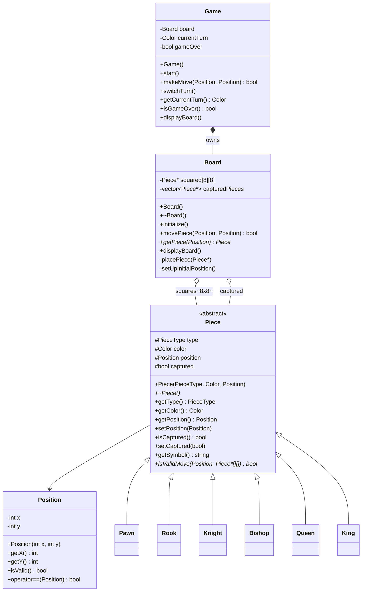

# Chess (LLD demo)

Small C++ chess sketch: console UI, polymorphic pieces, board and game loop.

## Build and run

From this directory:

```bash
g++ chessDemo.cpp game.cpp board.cpp position.cpp pieces/pawn.cpp pieces/rook.cpp pieces/knight.cpp pieces/bishop.cpp pieces/queen.cpp pieces/king.cpp -o chessDemo
./chessDemo
```

On Windows PowerShell:

```powershell
g++ chessDemo.cpp game.cpp board.cpp position.cpp pieces/pawn.cpp pieces/rook.cpp pieces/knight.cpp pieces/bishop.cpp pieces/queen.cpp pieces/king.cpp -o chessDemo
.\chessDemo.exe
```

Enter moves as four integers: `FromX FromY ToX ToY` (coordinates match the printed board). Enter `-1 -1 -1 -1` to quit.

## UML — class diagram



**Enums** (in `piece.hpp` with `Piece`): `PieceType`, `Color`.
